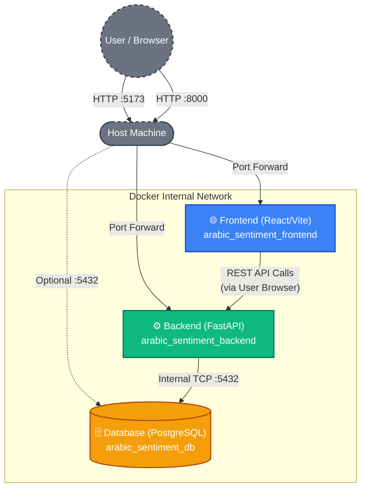

# Arabic Reviews Sentiment Analysis

A production-ready web application for analyzing sentiment in Arabic product reviews using domain-adapted transformer models. The system provides both REST API endpoints and a modern web interface for sentiment classification with confidence scores and user feedback capabilities.


## 🎯 Features

- **Sentiment Analysis**: Classify Arabic reviews into positive, negative, and neutral sentiments
- **High Accuracy**: Domain-adapted transformer model fine-tuned specifically for Arabic text
- **REST API**: Fast and scalable FastAPI endpoints with comprehensive error handling
- **Batch Processing**: Process multiple reviews efficiently in a single request
- **User Feedback System**: Collect user corrections to improve model performance over time
- **Web Dashboard**: Intuitive React-based frontend for easy interaction
- **Real-time Predictions**: Get instant sentiment predictions with confidence scores
- **Database Integration**: Store predictions and feedback in PostgreSQL for analytics
- **Docker Support**: Fully containerized application for easy deployment
- **Comprehensive Logging**: Detailed application logs for monitoring and debugging

  ## 🏗️ Architecture & Internal Networking

The application is built using a containerized microservices architecture orchestrated by Docker Compose. It consists of three decoupled services communicating over an internal bridge network.



## 🚀 Quick Start

### Prerequisites

- **Docker & Docker Compose** (recommended) or
- **Python 3.12+** and **Node.js 20+** (for local development)
- **PostgreSQL 15** (for local development)
- **GPU Support**: CUDA 12.1 (optional, for faster inference)

### Installation with Docker (Recommended)

1. **Clone the repository**
```bash
git clone https://github.com/yourusername/Arabic-Reviews-Sentiment.git
cd Arabic-Reviews-Sentiment
```

2. **Create environment file**
```bash
cp .env.example .env
# Edit .env and set POSTGRES_PASSWORD
```

3. **Build and start containers**
```bash
docker-compose build
docker-compose up -d
```

4. **Access the application**
- Frontend: http://localhost:5173
- API: http://localhost:8000
- API Docs: http://localhost:8000/docs

### Installation for Local Development

1. **Clone the repository**
```bash
git clone https://github.com/yourusername/Arabic-Reviews-Sentiment.git
cd Arabic-Reviews-Sentiment
```

2. **Create virtual environment**
```bash
python -m venv venv
# On Windows
venv\Scripts\activate
# On macOS/Linux
source venv/bin/activate
```

3. **Install Python dependencies**
```bash
pip install -r requirements.txt
```

4. **Configure environment**
```bash
cp .env.example .env
# Edit .env with your settings
```

5. **Initialize database**
```bash
python -c "from app.services.create_db import create_tables; create_tables()"
```

6. **Start the backend**
```bash
uvicorn app.main:app --reload --host 0.0.0.0 --port 8000
```

7. **Start the frontend (in another terminal)**
```bash
cd frontend
npm install
npm run dev
```

## 📋 Configuration

### Environment Variables

Copy `.env.example` to `.env` and configure:

```env
# Application
APP_NAME=Arabic Review Sentiment API
APP_VERSION=1.0.0

# Model Configuration
MODEL_PATH=model/cls_model              # Path to trained model
LABEL_MAP_PATH=model/label_map.json     # Label mapping file
DEVICE=-1                                # -1 for CPU, 0+ for GPU ID
MAX_LENGTH=128                           # Max token length

# Database
POSTGRES_HOST=localhost
POSTGRES_PORT=5432
POSTGRES_DB=arabic_sentiment
POSTGRES_USER=postgres
POSTGRES_PASSWORD=your_secure_password

# Logging
LOG_FILE=logs/app.log

# API
API_HOST=0.0.0.0
API_PORT=8000

# Frontend
FRONTEND_BACKEND_URL=http://localhost:8000
```

## 🏗️ Project Structure

```
Arabic-Reviews-Sentiment/
├── app/                           # Backend FastAPI application
│   ├── main.py                   # Application entry point
│   ├── core/
│   │   ├── config.py             # Configuration management
│   │   └── logger.py             # Logging setup
│   ├── models/
│   │   ├── schemas.py            # Pydantic request/response schemas
│   │   ├── inference.py          # Model loading and inference
│   │   └── preprocessing.py      # Text preprocessing for Arabic
│   ├── routes/
│   │   ├── predict.py            # Prediction endpoints
│   │   └── health.py             # Health check endpoints
│   └── services/
│       ├── predictor.py          # Single and batch prediction logic
│       ├── storage.py            # Database operations
│       └── create_db.py          # Database initialization
├── frontend/                      # React TypeScript frontend
│   ├── src/
│   │   ├── components/           # Reusable React components
│   │   ├── pages/                # Page components
│   │   ├── services/             # API client services
│   │   └── App.tsx               # Main app component
│   ├── package.json
│   └── vite.config.ts
├── tests/                         # Pytest test suite
│   ├── test_api.py              # API endpoint tests
│   ├── test_inference.py        # Model inference tests
│   ├── test_storage.py          # Database operation tests
│   └── test_preprocessing.py    # Text preprocessing tests
├── model/                         # Trained model artifacts
│   ├── cls_model/               # Transformer model directory
│   └── label_map.json           # Sentiment labels mapping
├── logs/                          # Application logs
├── Dockerfile.backend             # Backend container configuration
├── Dockerfile.frontend            # Frontend container configuration
├── docker-compose.yaml            # Docker services orchestration
├── requirements.txt               # Python dependencies
├── .env.example                   # Environment variables template
└── README.md                      # This file
```

## 🔌 API Endpoints

### Prediction

#### Single Review Prediction
```http
POST /predict
Content-Type: application/json

{
  "review": "هذا المنتج ممتاز جداً"
}
```

**Response:**
```json
{
  "review": "هذا المنتج ممتاز جداً",
  "sentiment": "positive",
  "confidence": 0.95,
  "timestamp": "2024-05-07T20:46:55Z"
}
```

#### Batch Prediction
```http
POST /batch_predict
Content-Type: application/json

{
  "reviews": [
    "منتج رائع وجودة عالية",
    "لا أنصح بهذا المنتج",
    "عادي وليس مميز"
  ]
}
```

**Response:**
```json
{
  "predictions": [
    {
      "review": "منتج رائع وجودة عالية",
      "sentiment": "positive",
      "confidence": 0.92
    },
    {
      "review": "لا أنصح بهذا المنتج",
      "sentiment": "negative",
      "confidence": 0.88
    },
    {
      "review": "عادي وليس مميز",
      "sentiment": "neutral",
      "confidence": 0.75
    }
  ],
  "summary": {
    "total": 3,
    "positive": 1,
    "negative": 1,
    "neutral": 1
  }
}
```

#### Submit Feedback
```http
POST /feedback
Content-Type: application/json

{
  "review": "هذا المنتج ممتاز جداً",
  "predicted_sentiment": "positive",
  "is_correct": true,
  "comment": "التصنيف دقيق جداً"
}
```

**Response:**
```json
{
  "message": "Feedback saved successfully"
}
```

### Health Check

```http
GET /health
```

**Response:**
```json
{
  "status": "healthy",
  "version": "1.0.0",
  "database": "connected"
}
```

### API Documentation

Interactive API documentation available at:
- **Swagger UI**: http://localhost:8000/docs
- **ReDoc**: http://localhost:8000/redoc

## 🧪 Testing

### Run Tests

```bash
# Run all tests
pytest

# Run with coverage
pytest --cov=app tests/

# Run specific test file
pytest tests/test_api.py

# Run with verbose output
pytest -v
```

### Test Coverage

- **test_api.py**: API endpoint validation
- **test_inference.py**: Model inference accuracy
- **test_storage.py**: Database operations
- **test_preprocessing.py**: Arabic text preprocessing

## 🐳 Docker Deployment

### Build Images
```bash
docker-compose build
```

### Start Services
```bash
docker-compose up -d
```

### View Logs
```bash
docker-compose logs -f backend
docker-compose logs -f frontend
```

### Stop Services
```bash
docker-compose down
```

### Remove Volumes (reset database)
```bash
docker-compose down -v
```

## 📊 Database Schema

The application uses PostgreSQL with the following main tables:

### predictions
```sql
CREATE TABLE predictions (
  id SERIAL PRIMARY KEY,
  review TEXT NOT NULL,
  sentiment VARCHAR(20) NOT NULL,
  confidence FLOAT NOT NULL,
  timestamp TIMESTAMP DEFAULT CURRENT_TIMESTAMP
);
```

### feedback
```sql
CREATE TABLE feedback (
  id SERIAL PRIMARY KEY,
  review TEXT NOT NULL,
  predicted_sentiment VARCHAR(20),
  is_correct BOOLEAN,
  comment TEXT,
  timestamp TIMESTAMP DEFAULT CURRENT_TIMESTAMP
);
```

## 🛠️ Development

### Backend Development

```bash
# Activate virtual environment
source venv/bin/activate

# Run with auto-reload
uvicorn app.main:app --reload

# Format code
black app/

# Type checking (if added)
mypy app/
```

### Frontend Development

```bash
cd frontend

# Install dependencies
npm install

# Start development server
npm run dev

# Build for production
npm run build

# Preview build
npm run preview
```

## 📦 Model Information

- **Type**: Domain-adapted Transformer (BERT-based)
- **Language**: Arabic (AraBERT or similar)
- **Classes**: Positive, Negative, Neutral
- **Input**: Arabic text (1-128 tokens)
- **Output**: Sentiment class with confidence score

### Model Path Structure
```
model/
├── cls_model/
│   ├── config.json
│   ├── pytorch_model.bin
│   ├── tokenizer.json
│   ├── tokenizer_config.json
│   └── vocab.txt
└── label_map.json
```

## 🔒 Security Considerations

- CORS is configured to allow all origins (adjust in production)
- Database credentials should be managed via environment variables
- API endpoints have error handling to prevent information leakage
- Input validation using Pydantic schemas
- SQL injection prevention via ORM

## 📈 Performance

- **Inference Latency**: ~100-200ms per review (CPU), ~20-50ms (GPU)
- **Batch Processing**: Process 100 reviews in ~1-2 seconds
- **Database**: PostgreSQL with connection pooling
- **API**: FastAPI ASGI server with Uvicorn

## 🚨 Troubleshooting

### Database Connection Error
```
Error: could not connect to server: Connection refused
```
**Solution**: Ensure PostgreSQL is running and credentials are correct in `.env`

### Model Loading Error
```
Error: No such file or directory: 'model/cls_model'
```
**Solution**: Ensure model files exist in the `model/` directory

### Port Already in Use
```
Error: Address already in use
```
**Solution**: Change port in `.env` or kill process using the port

### Docker Build Fails
```
Solution: Clear Docker cache: docker-compose build --no-cache
```

## 📝 License

This project is licensed under the MIT License - see LICENSE file for details.

## 👤 Author

Created for Arabic sentiment analysis research and production applications.

## 🤝 Contributing

Contributions are welcome! Please:

1. Fork the repository
2. Create a feature branch (`git checkout -b feature/amazing-feature`)
3. Commit your changes (`git commit -m 'Add amazing feature'`)
4. Push to the branch (`git push origin feature/amazing-feature`)
5. Open a Pull Request

## 📧 Support

For issues, questions, or suggestions, please open an [issue](https://github.com/yourusername/Arabic-Reviews-Sentiment/issues) on GitHub.

## 🎓 Citation

If you use this project in your research, please cite:

```bibtex
@software{arabic_sentiment_2024,
  title={Arabic Reviews Sentiment Analysis},
  author={Your Name},
  year={2024},
  url={https://github.com/yourusername/Arabic-Reviews-Sentiment}
}
```

---

**Last Updated**: May 2024  
**Version**: 1.0.0
